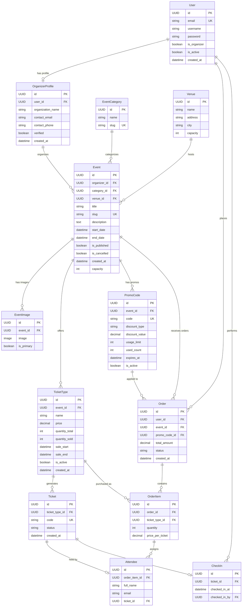

# Tickr - Event Registration & Ticketing Platform

Tickr is a Django-based event registration and ticketing platform that allows organizers to create events, sell tickets, and manage check-ins, while users can browse events, register, and attend using digital tickets.

**Live Demo:** [tickr.p1ng.me](https://tickr.p1ng.me)

## Features

### For Attendees
- User registration & login (custom session-based authentication)
- Browse and search published events
- View event details with venue and timing information
- Select ticket types and quantities
- Apply promo codes at checkout for discounts
- Receive digital tickets with unique codes
- View order history and ticket details
- Event-day check-in via ticket code

### For Organizers
- Create and manage organizer profiles
- Create, edit, and delete events
- Define multiple ticket types per event with pricing and quantity limits
- Create and manage promo codes (percentage or flat discounts)
- Monitor sales and order details
- Validate tickets during check-in
- View check-in statistics per event

## Tech Stack

- **Backend:** Django 6.0.2
- **Database:** SQLite (default), configurable for PostgreSQL/MySQL
- **Server:** Uvicorn (ASGI)
- **Frontend:** Server-rendered templates with Django template engine
- **Containerization:** Docker & Docker Compose

## Screenshots

<details>
<summary>Click to expand</summary>

### Homepage / Event Listing


### Event Details


### Ticket Selection


### Order Confirmation


### Digital Ticket


### Organizer Dashboard


### Event Management


### Check-in System


</details>

## Prerequisites

- Python 3.13+
- pip (Python package manager)
- Docker & Docker Compose (optional, for containerized setup)

## Installation

### Option 1: Local Development Setup

1. **Clone the repository**
   ```bash
   git clone https://github.com/yourusername/tickr.git
   cd tickr
   ```

2. **Create a virtual environment**
   ```bash
   python -m venv venv
   source venv/bin/activate  # On Windows: venv\Scripts\activate
   ```

3. **Install dependencies**
   ```bash
   pip install -r requirements.txt
   ```

4. **Set up environment variables** (optional for development)
   ```bash
   export SECRET_KEY="your-secret-key-here"
   export DEBUG=1
   export DJANGO_ALLOWED_HOSTS="localhost,127.0.0.1"
   ```

5. **Run database migrations**
   ```bash
   python manage.py migrate
   ```

6. **Create a superuser (optional, for admin access)**
   ```bash
   python manage.py createsuperuser
   ```

7. **Populate database with sample data (optional)**
   ```bash
   python manage.py populate_db
   ```

8. **Run the development server**
   ```bash
   python manage.py runserver
   ```
   Or with Uvicorn:
   ```bash
   uvicorn tickr.asgi:application --reload
   ```

9. **Access the application**
   - Main app: http://localhost:8000
   - Admin panel: http://localhost:8000/admin/

### Option 2: Docker Setup

1. **Clone the repository**
   ```bash
   git clone https://github.com/yourusername/tickr.git
   cd tickr
   ```

2. **Build and run with Docker Compose**
   ```bash
   docker-compose up --build
   ```

3. **Run migrations (in a new terminal)**
   ```bash
   docker-compose exec web python manage.py migrate
   ```

4. **Access the application**
   - Main app: http://localhost:8000

## Project Structure

```
tickr/
├── accounts/          # User authentication, registration, organizer profiles
├── events/            # Events, categories, venues, images
├── tickets/           # Ticket types & individual tickets
├── orders/            # Orders, order items, attendees
├── promotions/        # Promo codes (CRUD + validation)
├── checkin/           # Check-in system (scan, validate, stats)
├── core/              # Shared utilities (decorators, helpers, mixins)
├── templates/         # Global templates (base.html, includes/)
├── static/            # Static assets (CSS/JS)
├── media/             # User-uploaded files
├── tickr/             # Project settings and configuration
│   ├── settings.py
│   ├── urls.py
│   ├── wsgi.py
│   └── asgi.py
├── manage.py
├── requirements.txt
├── Dockerfile
├── docker-compose.yml
└── README.md
```

## Data Model & Schema



## Key Architecture Decisions

### Custom Authentication System
Tickr uses a **custom session-based authentication** system instead of Django's `contrib.auth`. This demonstrates:
- Understanding of Django sessions
- Custom password hashing with `make_password`/`check_password`
- Custom login/logout flows
- Role-based access control (user vs organizer)

### UUID Primary Keys
All models use UUID fields as primary keys for:
- Better security (non-sequential IDs)
- Distributed system compatibility
- Preventing enumeration attacks

### Server-Rendered Templates
The application uses Django's template engine for:
- Faster initial page loads
- SEO-friendly content
- Simpler deployment (no separate frontend build)

## Environment Variables

| Variable | Description | Default |
|----------|-------------|---------|
| `SECRET_KEY` | Django secret key for sessions/crypto | Auto-generated (change in production) |
| `DEBUG` | Enable debug mode | `1` (True) |
| `DJANGO_ALLOWED_HOSTS` | Comma-separated allowed hosts | `localhost,127.0.0.1` |

## URL Endpoints

Tickr uses server-rendered templates for its primary interface. Key URL structures include:

- `/events/` - Browse and search published events
- `/tickets/` - Manage ticket types and view digital tickets
- `/orders/` - Process ticket bookings and view order history
- `/promocodes/validate/` - Promo code validation
- `/checkin/` - Event-day check-in system

## Development

### Running Tests
```bash
python manage.py test
```

### Code Style
This project uses Ruff for linting and formatting.

### Database Migrations
```bash
python manage.py makemigrations
python manage.py migrate
```

## License

This project is open source and available under the [MIT License](LICENSE).

## Contributing

Contributions are welcome! Please feel free to submit a Pull Request.

1. Fork the repository
2. Create your feature branch (`git checkout -b feature/AmazingFeature`)
3. Commit your changes (`git commit -m 'Add some AmazingFeature'`)
4. Push to the branch (`git push origin feature/AmazingFeature`)
5. Open a Pull Request
