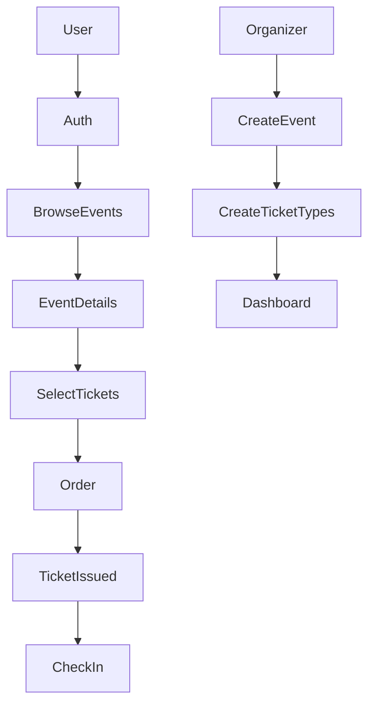
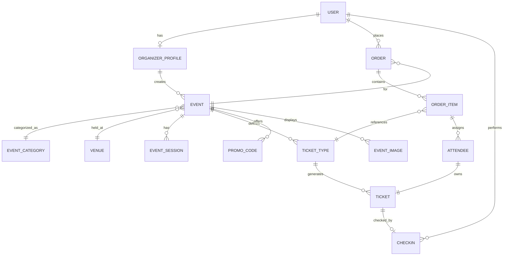

# Tickr — Event Registration & Ticketing Platform

Tickr is a Django-based event registration and ticketing platform that allows organizers to create events, sell tickets, and manage check-ins, while users can browse events, register, and attend using digital tickets.

This project is intentionally scoped to be complex enough to showcase real Django skills without becoming unmanageable.

---

## 1. Core Features

### User Side
- User registration & login
- Browse public events
- View event details
- Select ticket types
- Register / book tickets
- Apply promo codes
- Receive digital tickets
- Event-day check-in via QR / code

### Organizer Side
- Organizer profile
- Create & manage events
- Define venues and sessions
- Create ticket types
- Monitor sales & attendance
- Validate tickets during check-in

---

## 2. Apps Structure

```
tickr/
├── accounts/
├── events/
├── tickets/
├── orders/
├── checkin/
├── promotions/
├── core/
```

---

## 3. Models Schema

### Accounts

#### User (Custom)
- id
- email (unique)
- username
- is_organizer
- is_staff
- is_active
- date_joined

#### OrganizerProfile
- id
- user (OneToOne → User)
- organization_name
- contact_email
- contact_phone
- verified
- created_at

---

### Events

#### EventCategory
- id
- name
- slug

#### Venue
- id
- name
- address
- city
- capacity

#### Event
- id
- organizer (FK → OrganizerProfile)
- category (FK → EventCategory)
- venue (FK → Venue)
- title
- slug
- description
- start_date
- end_date
- is_published
- is_cancelled
- created_at

#### EventSession
- id
- event (FK → Event)
- start_time
- end_time
- capacity

#### EventImage
- id
- event (FK → Event)
- image
- is_primary

---

### Tickets

#### TicketType
- id
- event (FK → Event)
- name
- price
- quantity_total
- quantity_sold
- sale_start
- sale_end
- is_active

#### Ticket
- id
- ticket_type (FK → TicketType)
- code (unique)
- status (available / booked / cancelled)
- created_at

---

### Orders & Registration

#### Order
- id
- user (FK → User)
- event (FK → Event)
- total_amount
- status (pending / paid / cancelled)
- created_at

#### OrderItem
- id
- order (FK → Order)
- ticket_type (FK → TicketType)
- quantity
- price_per_ticket

#### Attendee
- id
- order_item (FK → OrderItem)
- full_name
- email
- ticket (OneToOne → Ticket)

---

### Check-in

#### CheckIn
- id
- ticket (OneToOne → Ticket)
- checked_in_at
- checked_in_by (FK → User)

---

### Promotions

#### PromoCode
- id
- event (FK → Event)
- code
- discount_type (percentage / flat)
- discount_value
- usage_limit
- used_count
- expires_at
- is_active

---

## 4. API Endpoints

### Accounts
- POST /auth/register/
- POST /auth/login/
- POST /auth/logout/
- GET /auth/me/
- GET /organizer/profile/
- POST /organizer/profile/
- PUT /organizer/profile/

### Events
- GET /events/
- GET /events/<slug>/
- POST /events/
- PUT /events/<id>/
- DELETE /events/<id>/
- GET /events/<id>/sessions/
- POST /events/<id>/sessions/
- GET /categories/
- GET /venues/

### Tickets
- GET /events/<id>/tickets/
- POST /events/<id>/tickets/
- PUT /tickets/types/<id>/
- DELETE /tickets/types/<id>/
- GET /tickets/<code>/

### Orders
- POST /orders/
- GET /orders/<id>/
- POST /orders/<id>/confirm/
- POST /orders/<id>/cancel/
- GET /my/orders/
- POST /orders/<id>/attendees/

### Check-in
- POST /checkin/
- GET /checkin/event/<id>/
- GET /checkin/ticket/<code>/

### Promotions
- POST /promocodes/
- PUT /promocodes/<id>/
- DELETE /promocodes/<id>/
- POST /promocodes/validate/
- GET /events/<id>/promocodes/

---

## 5. System Flow Diagram (Mermaid)



---

## 6. ER Diagram (Mermaid)



---

## 7. Recommended Build Order

1. accounts
2. events
3. tickets
4. orders
5. promotions
6. checkin
7. core

---

## 8. Why Tickr Is a Strong Project

- Real-world domain
- Proper Django ORM usage
- Clear model relationships
- Extendable to payments, APIs, mobile apps
- Resume-safe and interview-friendly

