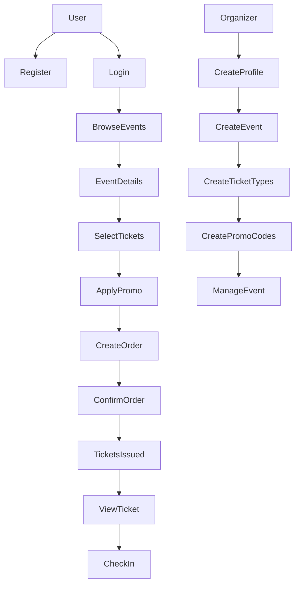
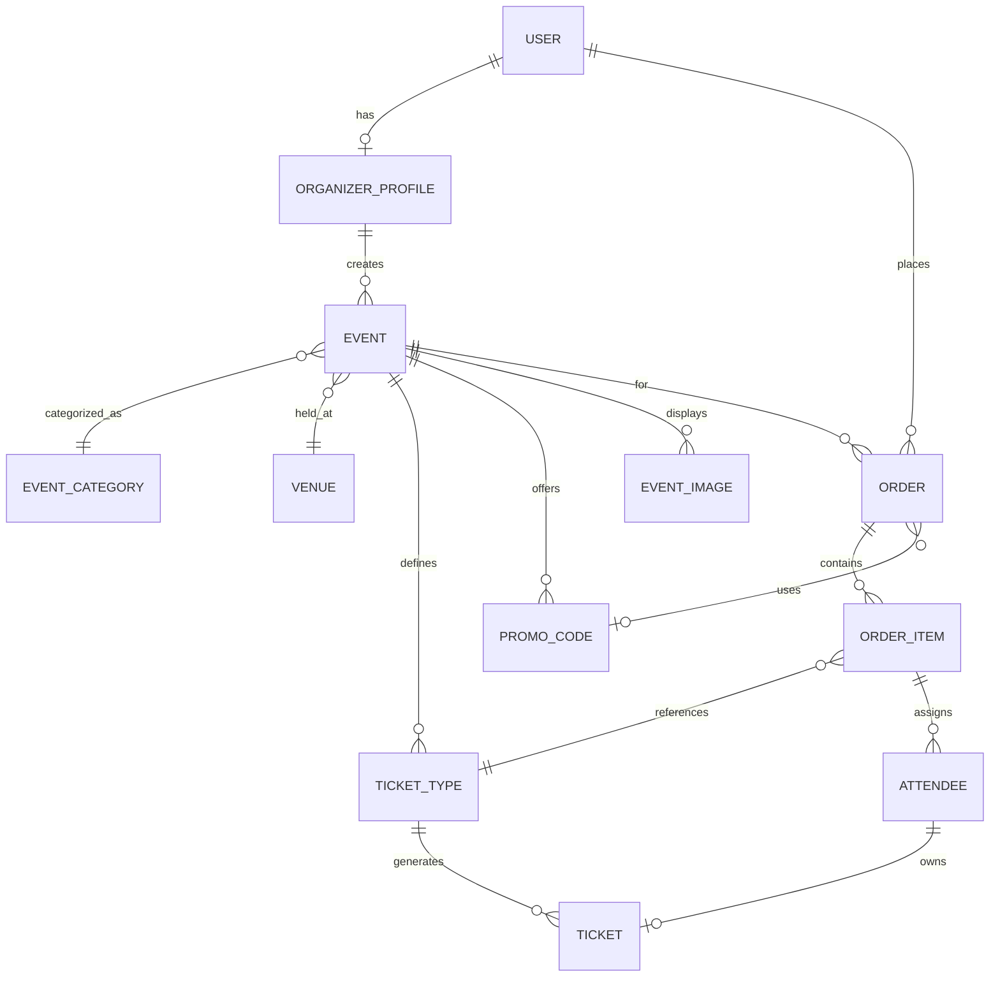

# Tickr — Event Registration & Ticketing Platform

Tickr is a Django-based event registration and ticketing platform that allows organizers to create events, sell tickets, and manage check-ins, while users can browse events, register, and attend using digital tickets.

This project is intentionally scoped to be complex enough to showcase real Django skills without becoming unmanageable. It uses server-rendered templates with Django's class-based views and a custom session-based authentication system (no Django `auth` contrib).

---

## 1. Core Features

### User Side
- User registration & login (custom session auth)
- Browse published events
- View event details
- Select ticket types & quantities
- Register / book tickets (create orders)
- Apply promo codes at checkout
- Receive digital tickets (unique codes)
- View order history & ticket details
- Event-day check-in via QR / code *(not yet implemented)*

### Organizer Side
- Organizer profile (create & update)
- Create & manage events (CRUD)
- Create & manage ticket types per event
- Create & manage promo codes per event
- Validate promo codes
- Monitor sales via order details
- Validate tickets during check-in *(not yet implemented)*

---

## 2. Apps Structure

```
tickr/
├── accounts/          # User auth, registration, organizer profiles
├── events/            # Events, categories, venues, images
├── tickets/           # Ticket types & individual tickets
├── orders/            # Orders, order items, attendees
├── promotions/        # Promo codes (CRUD + validation)
├── checkin/           # Check-in system (stub — not yet implemented)
├── core/              # Shared utilities (stub — not yet implemented)
├── templates/         # Global templates (base.html, includes/)
└── static/            # Static assets (CSS/JS)
```

---

## 3. Models Schema

### Accounts

#### User (Custom — not using Django `auth.User`)
- id (UUIDField, PK)
- email (EmailField, unique)
- username (CharField)
- password (CharField — hashed via `make_password`)
- is_organizer (BooleanField, default=False)
- is_active (BooleanField, default=True)
- created_at (DateTimeField, auto)

#### OrganizerProfile
- id (UUIDField, PK)
- user (OneToOne → User)
- organization_name (CharField)
- contact_email (EmailField)
- contact_phone (CharField)
- verified (BooleanField, default=False)
- created_at (DateTimeField, auto)

---

### Events

#### EventCategory
- id (UUIDField, PK)
- name (CharField)
- slug (SlugField, unique)

#### Venue
- id (UUIDField, PK)
- name (CharField)
- address (CharField)
- city (CharField)
- capacity (IntegerField)

#### Event
- id (UUIDField, PK)
- organizer (FK → OrganizerProfile)
- category (FK → EventCategory)
- venue (FK → Venue)
- title (CharField)
- slug (SlugField, unique)
- description (TextField)
- start_date (DateTimeField)
- end_date (DateTimeField)
- is_published (BooleanField, default=False)
- is_cancelled (BooleanField, default=False)
- created_at (DateTimeField, auto)
- capacity (PositiveIntegerField, default=0)

#### EventImage
- id (UUIDField, PK)
- event (FK → Event)
- image (ImageField)
- is_primary (BooleanField, default=False)

---

### Tickets

#### TicketType
- id (UUIDField, PK)
- event (FK → Event)
- name (CharField)
- price (DecimalField)
- quantity_total (IntegerField)
- quantity_sold (IntegerField, default=0)
- sale_start (DateTimeField)
- sale_end (DateTimeField)
- is_active (BooleanField, default=True)
- created_at (DateTimeField, auto)
- **Properties:** `quantity_available`, `is_on_sale`
- **Meta:** ordering = `["sale_start", "name"]`

#### Ticket
- id (UUIDField, PK)
- ticket_type (FK → TicketType)
- code (CharField, unique — 12-char alphanumeric)
- status (CharField: `available` / `booked` / `cancelled`)
- created_at (DateTimeField, auto)
- **Class method:** `generate_unique_code()`
- **Meta:** ordering = `["-created_at"]`

---

### Orders & Registration

#### Order
- id (UUIDField, PK)
- user (FK → User)
- event (FK → Event)
- total_amount (DecimalField, default=0)
- status (CharField: `pending` / `paid` / `cancelled`)
- promo_code (FK → PromoCode, nullable)
- created_at (DateTimeField, auto)
- **Method:** `recalculate_total()`
- **Meta:** ordering = `["-created_at"]`

#### OrderItem
- id (UUIDField, PK)
- order (FK → Order)
- ticket_type (FK → TicketType)
- quantity (PositiveIntegerField)
- price_per_ticket (DecimalField)
- **Property:** `subtotal`

#### Attendee
- id (UUIDField, PK)
- order_item (FK → OrderItem)
- full_name (CharField)
- email (EmailField)
- ticket (OneToOne → Ticket, nullable)

---

### Check-in *(not yet implemented)*

#### CheckIn
- id
- ticket (OneToOne → Ticket)
- checked_in_at
- checked_in_by (FK → User)

---

### Promotions

#### PromoCode
- id (UUIDField, PK)
- event (FK → Event)
- code (CharField, unique — auto-uppercased on save)
- discount_type (CharField: `percentage` / `flat`)
- discount_value (DecimalField)
- usage_limit (PositiveIntegerField, default=0 → unlimited)
- used_count (PositiveIntegerField, default=0)
- expires_at (DateTimeField, nullable)
- is_active (BooleanField, default=True)
- **Properties:** `is_valid`
- **Methods:** `apply_discount(amount)`, custom `save()`
- **Meta:** ordering = `["-is_active", "code"]`

---

## 4. URL Endpoints (Template-Based Views)

### Accounts (`/auth/`)
| Method | URL | View | Description |
|--------|-----|------|-------------|
| GET/POST | `/auth/register/` | `RegisterView` | Registration form & create account |
| GET/POST | `/auth/login/` | `LoginView` | Login form & authenticate |
| GET/POST | `/auth/logout/` | `LogoutView` | Logout (clears session) |
| GET | `/auth/me/` | `MeView` | Current user profile |
| GET/POST | `/organizer/profile/` | `OrganizerProfileView` | Create/update organizer profile |

### Events (`/events/`)
| Method | URL | View | Description |
|--------|-----|------|-------------|
| GET | `/events/` | `EventListView.get` | List published events + organizer's events |
| POST | `/events/` | `EventListView.post` | Create event (organizer only) |
| GET | `/events/create/` | `EventCreateView` | Show create event form |
| GET | `/events/<slug>/` | `EventDetailView` | Event detail page |
| GET/POST | `/events/<id>/edit/` | `EventUpdateView` | Edit event (owner only) |
| GET/POST | `/events/<id>/delete/` | `EventDeleteView` | Delete event (owner only) |
| GET | `/categories/` | `CategoryListView` | List all categories |
| GET | `/venues/` | `VenueListView` | List all venues |

### Tickets (`/tickets/`)
| Method | URL | View | Description |
|--------|-----|------|-------------|
| GET | `/events/<id>/tickets/` | `TicketTypeListView.get` | List ticket types for event |
| POST | `/events/<id>/tickets/` | `TicketTypeListView.post` | Create ticket type (owner only) |
| GET/POST | `/tickets/types/<id>/` | `TicketTypeUpdateView` | Update ticket type (owner only) |
| GET/POST | `/tickets/types/<id>/delete/` | `TicketTypeDeleteView` | Delete ticket type (owner only) |
| GET | `/tickets/<code>/` | `TicketDetailView` | View ticket by code |

### Orders (`/orders/`)
| Method | URL | View | Description |
|--------|-----|------|-------------|
| GET | `/orders/?event=<id>` | `OrderCreateView.get` | Show ticket selection form |
| POST | `/orders/` | `OrderCreateView.post` | Create order with items |
| GET | `/orders/<id>/` | `OrderDetailView` | Order details with items/attendees |
| POST | `/orders/<id>/confirm/` | `OrderConfirmView` | Confirm/pay order & issue tickets |
| POST | `/orders/<id>/cancel/` | `OrderCancelView` | Cancel order & release tickets |
| GET | `/my/orders/` | `MyOrdersView` | List current user's orders |
| GET/POST | `/orders/<id>/attendees/` | `AttendeeCreateView` | Add attendee info to order |

### Promotions (`/promocodes/`)
| Method | URL | View | Description |
|--------|-----|------|-------------|
| GET/POST | `/promocodes/` | `PromoCodeCreateView` | Create promo code (organizer only) |
| GET/POST | `/promocodes/<id>/` | `PromoCodeUpdateView` | Edit promo code (owner only) |
| GET/POST | `/promocodes/<id>/delete/` | `PromoCodeDeleteView` | Delete promo code (owner only) |
| POST | `/promocodes/validate/` | `PromoCodeValidateView` | Validate promo code (returns JSON or redirect) |
| GET | `/events/<id>/promocodes/` | `EventPromoCodeListView` | List promo codes for event (organizer only) |

### Admin
| Method | URL | Description |
|--------|-----|-------------|
| GET | `/admin/` | Django Admin panel |

### Check-in *(not yet implemented)*

---

## 5. Authentication System

Tickr uses a **custom session-based authentication** system (`accounts/auth.py`) — it does **not** use Django's `contrib.auth` or `AbstractUser`.

- **Session key:** stores user UUID in `request.session`
- **Helper functions:** `login_user()`, `logout_user()`, `get_request_user()`
- **Passwords:** hashed via `django.contrib.auth.hashers.make_password` / `check_password`
- **Decorators:** `login_required`, `organizer_required` (in `accounts/views.py`)
- **Ownership checks:** helper functions (`_event_owned_by_user`, `_ticket_type_owned_by_user`, etc.) enforce organizer-only access

---

## 6. Templates

All views render server-side HTML templates using Django's template engine.

```
templates/
├── base.html                              # Global layout + nav
└── includes/
    └── daterangepicker.html

accounts/templates/accounts/
├── login.html
├── register.html
├── me.html
└── organizer_profile.html

events/templates/events/
├── event_list.html
├── event_detail.html
├── event_form.html
├── event_confirm_delete.html
├── category_list.html
└── venue_list.html

tickets/templates/tickets/
├── ticket_type_list.html
├── ticket_type_form.html
├── ticket_type_confirm_delete.html
└── ticket_detail.html

orders/templates/orders/
├── order_create.html
├── order_detail.html
├── my_orders.html
└── attendee_form.html

promotions/templates/promotions/
├── promocode_form.html
├── promocode_list.html
└── promocode_confirm_delete.html
```

---

## 7. Forms (Django Forms)

Each app defines its own forms in `forms.py`:

| App | Forms |
|-----|-------|
| `accounts` | `LoginForm`, `RegisterForm`, `OrganizerProfileForm` |
| `events` | `EventForm` |
| `tickets` | `TicketTypeForm` |
| `orders` | `OrderTicketForm`, `AttendeeForm` |
| `promotions` | `PromoCodeForm`, `PromoCodeValidateForm` |

---

## 8. System Flow Diagram (Mermaid)



---

## 9. ER Diagram (Mermaid)



---

## 10. Build Order & Status

| # | App | Status |
|---|-----|--------|
| 1 | `accounts` | ✅ Complete |
| 2 | `events` | ✅ Complete |
| 3 | `tickets` | ✅ Complete |
| 4 | `orders` | ✅ Complete |
| 5 | `promotions` | ✅ Complete |
| 6 | `checkin` | ⬜ Not started (app created, no models/views) |
| 7 | `core` | ⬜ Not started (app created, no models/views) |

---

## 11. Why Tickr Is a Strong Project

- Real-world domain with multi-role access (user vs organizer)
- Proper Django ORM usage with UUIDs, ForeignKeys, OneToOne
- Custom session-based auth (demonstrates understanding beyond contrib.auth)
- Clean model relationships with helper methods & properties
- Form validation and ownership-based access control
- Server-rendered templates with reusable base layout
- Extendable to payments, check-in, REST APIs, mobile apps
- Resume-safe and interview-friendly
